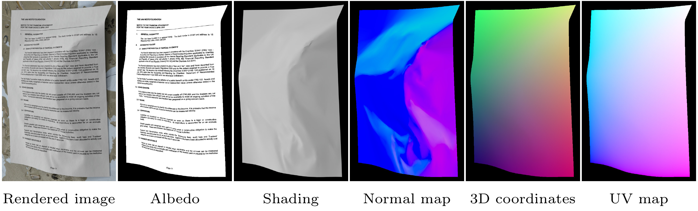

# SyntheticDoc: A Large Synthetic Dataset for Document Unwarping and Illumination Correction

[Daniel Woortmann](https://ch.linkedin.com/in/daniel-woortmann-915583224/)\*, [Tanguy Magne](https://tanguymagne.com/)\*, [Olga Sorkine-Hornung](https://igl.ethz.ch/people/sorkine/index.php)<br />
\* Equal contribution


<a href="https://igl.ethz.ch/projects/SyntheticDoc/"></a>
<a href="https://doi.org/10.3929/ethz-c-000801994"></a>
<a href="https://igl.ethz.ch/projects/SyntheticDoc/syntheticdoc-eccv-2026-woortmann-et-al.pdf" alt ="paper"> </a>




This repository contains the code and data for the ECCV paper **"SyntheticDoc: A Large Synthetic Dataset for Document Unwarping and Illumination Correction"**.

## 📁 Dataset

Our dataset is available [here](https://doi.org/10.3929/ethz-c-000801994). Note that, for now, only the rendered image, albedo, shading, UV, backward mapping, and metadata are available for each sample. The remaining annotations (normal maps and 3D coordinates) will be released soon.

Documentation about the currently released dataset can be found [here](https://github.com/tanguymagne/SyntheticDoc/blob/main/DATASET.md).

The assets it was generated from (meshes, document pages and background materials) are available [here](https://doi.org/10.3929/ethz-c-000804058).

## 💻 Code

The code to generate the dataset is now available: [`generation/simulation`](https://github.com/tanguymagne/SyntheticDoc/blob/main/generation/simulation) simulates the deformed paper meshes, and [`generation/rendering`](https://github.com/tanguymagne/SyntheticDoc/blob/main/generation/rendering) renders the final samples (images and annotations).

The code to train the model and to run it on your own images is available in the [`training`](https://github.com/tanguymagne/SyntheticDoc/blob/main/training) folder.

## 🪪 Citation

```
@inproceedings{SyntheticDoc:2026,
    author = {Woortmann, Daniel and Magne, Tanguy and Sorkine-Hornung, Olga},
    title = {{SyntheticDoc}: A Large Synthetic Dataset for Document Unwarping and Illumination Correction},
    booktitle={Computer Vision -- ECCV 2026},
    year = {2026},
}
```
