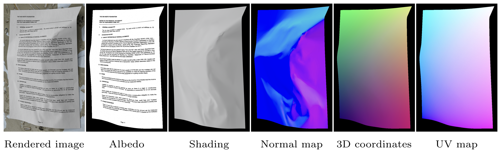

# SyntheticDoc: A Large Synthetic Dataset for Document Unwarping and Illumination Correction

Daniel Woortmann*, [Tanguy Magne*](https://tanguymagne.com/), [Olga Sorkine-Hornung](https://igl.ethz.ch/people/sorkine/index.php)<br />
\* Equal contribution


<!-- <a href="https://igl.ethz.ch/projects/syntheticdoc/"></a> -->
<!-- <a href="https://igl.ethz.ch/projects/syntheticdoc/" alt ="paper"> </a> -->
<!-- <a href="https://doi.org/" alt="doi"></a> -->
<a href="http://hdl.handle.net/20.500.11850/801994"></a>




This repository contains the code and data for the ECCV paper **"SyntheticDoc: A Large Synthetic Dataset for Document Unwarping and Illumination Correction"**.

## 📁 Dataset

Our dataset is available [here](http://hdl.handle.net/20.500.11850/801994). Note that, for now, only the rendered image, albedo, shading, UV, backward mapping, and metadata are available for each sample. The remaining annotations (normal maps and 3D coordinates) will be released soon.

Documentation about the currently released dataset can be found [here](https://github.com/tanguymagne/SyntheticDoc/blob/main/DATASET.md).

## 💻 Code

The code to generate the dataset and train the model will be released soon. Stay tuned!

<!-- The code for the model training and the model itself is partially based on the [UVDoc](https://github.com/tanguymagne/UVDoc). -->

## 🪪 Citation

```
@inproceedings{SyntheticDoc:2026,
    author = {Woortmann, Daniel and Magne, Tanguy and Sorkine-Hornung, Olga},
    title = {{SyntheticDoc}: A Large Synthetic Dataset for Document Unwarping and Illumination Correction},
    booktitle={Computer Vision -- ECCV 2026},
    year = {2026},
}
```