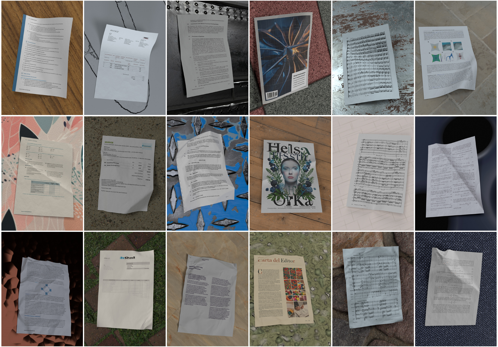

# 🎨 Dataset Rendering



This folder contains everything needed to turn the deformed paper meshes into the rendered images and ground truth annotations that make up the SyntheticDoc dataset. Rendering is done with [Blender](https://www.blender.org/)'s Cycles path tracer, driven entirely from Python.

Each sample is a rendering of one document image, textured onto one deformed paper mesh, lying on one background material. It is accompanied by several groundt truth annotations.

The code is modular: each component of the scene (camera, lighting, materials, environment, mesh) lives in its own file, and `single_sample_renderer.py` assembles them.

**⚠️ All the commands below must be run from this folder (`generation/rendering`)**, as the default asset and output paths are relative to it.

---

## 📋 Table of Contents
- [🛠️ Installation](#️-installation)
- [📁 Assets](#-assets)
- [🚀 Rendering](#-rendering)
- [🖼️ Outputs](#️-outputs)
- [⚙️ Configuration](#️-configuration)
- [⚠️ Known limitations](#️-known-limitations)

---

## 🛠️ Installation

This code runs **inside Blender**, against its bundled Python interpreter and the `bpy` module. There is no virtual environment to create and no dependency to install: everything used is either part of the standard library or shipped with Blender.

The only requirement is therefore [Blender](https://www.blender.org/download/) itself. We used **Blender 4.5 LTS**; every release, for every platform, can be downloaded from the [Blender release archive](https://download.blender.org/release/).

The commands below assume `blender` is on your `PATH`. If it is not, replace it with the full path to the executable — on macOS, that is inside the application bundle (`/Applications/Blender.app/Contents/MacOS/Blender`).

---

## 📁 Assets

Rendering needs three kinds of assets:

| Asset           | Format                          | Where it comes from                                                        |
| --------------- | ------------------------------- | -------------------------------------------------------------------------- |
| **Meshes**      | `.obj` files                    | The output of [`simulations`](../simulation), or any deformed sheet meshes |
| **Documents**   | `.png` page images              | Any collection of document page renders                                    |
| **Backgrounds** | Directories of PBR texture maps | Any PBR material library                                                   |

The exact assets used to render SyntheticDoc can be downloaded from the [ETH Research Collection](http://hdl.handle.net/20.500.11850/804058). Extract them so that the three asset folders sit next to the code:

```
generation/rendering/
├── meshes/
├── documents/
└── backgrounds/
```

Backgrounds are recognised as directories rather than single files: any directory containing at least one image is treated as one PBR material, and the maps inside it are matched by name (base colour, roughness, normal, …).

---

## 🚀 Rendering

To render a range of samples:

```bash
blender --background --python dataset_generator.py -- \
    --start 0 --end 1000 \
    --mesh-dir       ./meshes \
    --document-dir   ./documents \
    --background-dir ./backgrounds \
    --output-dir     ./renders
```

Everything before `--` is consumed by Blender itself; everything after it is parsed by the script.

| Option             | Description                                                |
| ------------------ | ---------------------------------------------------------- |
| `--start`          | First sample ID to render, inclusive. **Required.**        |
| `--end`            | Last sample ID to render, exclusive. **Required.**         |
| `--mesh-dir`       | Directory holding the `.obj` meshes, searched recursively. |
| `--document-dir`   | Directory holding the `.png` document pages.               |
| `--background-dir` | Directory holding the background material directories.     |
| `--output-dir`     | Where the samples are written. Default `./renders`.        |

### Rendering a single sample

`single_sample_renderer.py` renders one sample from assets given explicitly, which is the quickest way to check a setup:

```bash
blender --background --python single_sample_renderer.py -- \
    --mesh-path       ./meshes/curve_by_pull/00000.obj \
    --document-path   ./documents/arxiv/page_000000_2601.23286v1_p1.png \
    --background-path ./backgrounds/test_Ceramic_0557_brick_uneven_stones/ \
    --output-dir      ./renders
```

| Option              | Description                                                                                        |
| ------------------- | -------------------------------------------------------------------------------------------------- |
| `--mesh-path`       | Path to the `.obj` mesh. **Required.**                                                             |
| `--document-path`   | Path to the document `.png`. **Required.**                                                         |
| `--background-path` | Path to the background material directory. **Required.**                                           |
| `--output-dir`      | Where the sample is written. Default `./renders`.                                                  |
| `--sample-id`       | ID of the sample, also used as the random seed. Default `0`.                                       |
| `--camera-distance` | Distance from the page to the camera. Default `0.6`.                                               |
| `--flip-mesh`       | Render the back side of the page.                                                                  |
| `--save-blend-file` | Also save the Blender scene next to the outputs.                                                   |
| `--compress-pngs`   | Compress the PNG outputs with [oxipng](https://github.com/oxipng/oxipng), which must be installed. |

---

## 🖼️ Outputs

Each sample is written to its own directory, named with the zero-padded sample ID:

```
renders/0000000/
├── render.png        # The rendered image
├── albedo.png        # The document texture, unlit
├── shadow.png        # The illumination of the page, blank document
├── uv_inverse.exr    # UV coordinate of every visible point of the page
├── 3d.exr            # World XYZ position of every visible point
├── normal.exr        # Surface normal of every visible point
└── metadata.json     # Assets, camera angle and status of the sample
```
Additionaly, a `.blend` file of the scene can saved on request.

---

## ⚙️ Configuration

`config.py` holds every tunable parameter of the rendering, grouped into sections: render, object, camera, lighting, physics and materials settings. The values there are the ones SyntheticDoc was rendered with. 

---

## ⚠️ Known limitations

**GPU rendering is restricted to CUDA.** `scene_setup.setupRenderSettings` sets the Cycles compute device to `CUDA` and disables every other device, so the dataset was rendered on NVIDIA GPUs only. On other hardware (AMD, Apple, Intel) no device is enabled and Cycles silently falls back to CPU rendering, which is much slower. Detecting the available backend (OptiX / CUDA / HIP / Metal / oneAPI) and warning when falling back to CPU is left as a future improvement.
