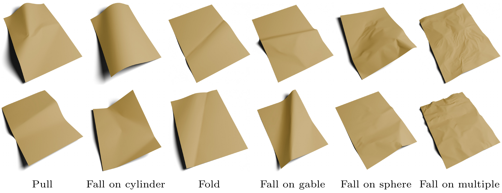

# 📃 Paper Simulation



This folder contains everything needed to generate the 3D meshes of deformed paper the SyntheticDoc dataset is rendered from. The deformations are physically simulated with [ARCSim](https://graphics.eecs.berkeley.edu/resources/ARCSim/).

Mesh generation is a two-step process:

1. **Generate configs.** A config is a JSON scene description telling ARCSim what to simulate: the sheet, the obstacles, the gravity, the forces pulling on it.
2. **Simulate.** ARCSim runs each config and writes the deformed sheet as an `.obj` mesh, which the rendering stage then takes as input.

**⚠️ All the commands below must be run from this folder (`generation/simulation`)**, as the configs refer to the assets and to the output directories by relative paths.

---

## 📋 Table of Contents
- [🛠️ Installation](#️-installation)
- [🎬 Simulation scenarios](#-simulation-scenarios)
- [⚙️ Generating configs](#️-generating-configs)
- [🧪 Running the simulation](#-running-the-simulation)
- [👀 Visualising the meshes](#-visualising-the-meshes)

---

## 🛠️ Installation

### Python

The Python side is light: only the config generation and the viewer depend on it.

```bash
conda create -n syntheticdoc-sim python=3.12 -y
conda activate syntheticdoc-sim
pip install -r requirements.txt
```

### ARCSim

The simulator itself is not shipped with this repository and has to be compiled once. Download **ARCSim v0.2.1** from its [official page](https://graphics.eecs.berkeley.edu/resources/ARCSim/) and extract it into this folder, so that the source ends up in `generation/simulation/arcsim-0.2.1`:

```bash
wget https://graphics.eecs.berkeley.edu/resources/ARCSim/arcsim-0.2.1.tar.gz
tar -xzf arcsim-0.2.1.tar.gz
```

ARCSim needs BLAS, Boost, freeglut, gfortran, LAPACK and libpng, all available through the package manager of any Linux distribution. Its dependencies are compiled first, then the simulator itself:

```bash
cd arcsim-0.2.1/dependencies && make
cd .. && make
```

This produces the `arcsim-0.2.1/bin/arcsim` binary, which is the one `simulate.py` runs. Check that the build works with `bin/arcsim simulate conf/sphere.json`: a sheet should appear above a sphere, and start falling when you hit Space. The `INSTALL` and `README` files of the release cover the process in more detail, including the extra steps needed on macOS.

**⚠️ ARCSim is released for non-commercial use only, and asks that any publication using it cites its papers.** See the `LICENSE` file of the release.

---

## 🎬 Simulation scenarios

Each simulation scenario deforms the paper in a different way. Together they cover the range of shapes a document takes in a photo, from a page barely curved on a desk to a heavily crumpled one. The figure at the top of this page shows two meshes from each of them.

Note that the scenarios have slightly different names in the [paper](https://igl.ethz.ch/projects/SyntheticDoc/syntheticdoc-eccv-2026-woortmann-et-al.pdf). The correspondence between the names in the paper and the ones in the code and the dataset is listed below.

| Scenario         | Name in Paper    | Effect on the paper mesh                                                                                       |
|------------------|------------------|----------------------------------------------------------------------------------------------------------------|
| `curve_by_pull`  | Pull             | Pull on one or two (edge) vertices of the paper to create soft curvature.                                      |
| `fall_on_ball`   | Fall on sphere   | Let the paper fall onto spheres with varying gravity, creating both hard and soft creases and curvature.       |
| `fall_on_many`   | Fall on multiple | Let the paper fall onto a dense grid of small spheres with strong gravity, crumpling it with many creases.     |
| `fall_on_roller` | Fall on cylinder | Let the paper fall onto cylinders with fixed gravity, creating soft curvature.                                 |
| `fall_on_roof`   | Fall on gable    | Let the paper fall onto roof shapes to create more acute angles, varying gravity to force the paper onto them. |
| `fold_by_pull`   | Fold             | Fold the paper by pulling an edge over it, then unfold it to create realistic fold creases.                    |

### Adding a scenario

Each scenario is one file in `config_generators/`, holding a subclass of `ConfigGenerator` with three methods to fill in. The quickest way to write a new one is to copy the closest existing scenario and adapt it:

1. `set_configs` — pick the scene skeleton to start from in `base_configs/`, and the obstacle to add to it.
2. `set_parameters` — declare the range each randomised quantity is drawn from, such as the gravity or the number of obstacles.
3. `generate` — draw the random values, write them into a copy of the skeleton, and save it.

Then register the new class in `generate_configs.py`, so that it can be called by name, and give it a time step in `simulate.py`. The faster the collisions of a scenario, the finer its time step has to be.

---

## ⚙️ Generating configs

To generate configs for a scenario, run:

```bash
python generate_configs.py --config-type curve_by_pull --num 100 --seed 0
```

| Option          | Description                                                    |
|-----------------|----------------------------------------------------------------|
| `--config-type` | Scenario to generate, one of the six names in the table above. |
| `--num`         | Number of configs to generate. Default `1`.                    |
| `--seed`        | Random seed, for reproducibility. Default `0`.                 |

The configs are written to `configs/<scenario>/`, numbered `00000.json`, `00001.json`, …

---

## 🧪 Running the simulation

To simulate configs that have been generated, pass their ids:

```bash
python simulate.py --scenario curve_by_pull --ids 0 1 2
```

Each simulation writes to `meshes/<scenario>/<id>/`. Only the final mesh is of interest, so the intermediate ones, the obstacle meshes and the logs are deleted, leaving:

```
meshes/curve_by_pull/00000/
├── 0100_00.obj    # The final mesh
├── conf.json      # The config it was simulated from
└── done.txt       # Written last, marks the simulation as complete
```

When simulating in bulk, `done.txt` is what distinguishes a finished simulation from an interrupted one, so that the latter can be run again.

---

## 👀 Visualising the meshes

Simulated meshes can be inspected with:

```bash
python visualize_results.py
```

This opens a [polyscope](https://polyscope.run/py/) window showing one mesh at a time, with buttons and a slider to move through them. All the meshes under `meshes/` are shown; edit the path at the bottom of the script to look at a single scenario.
